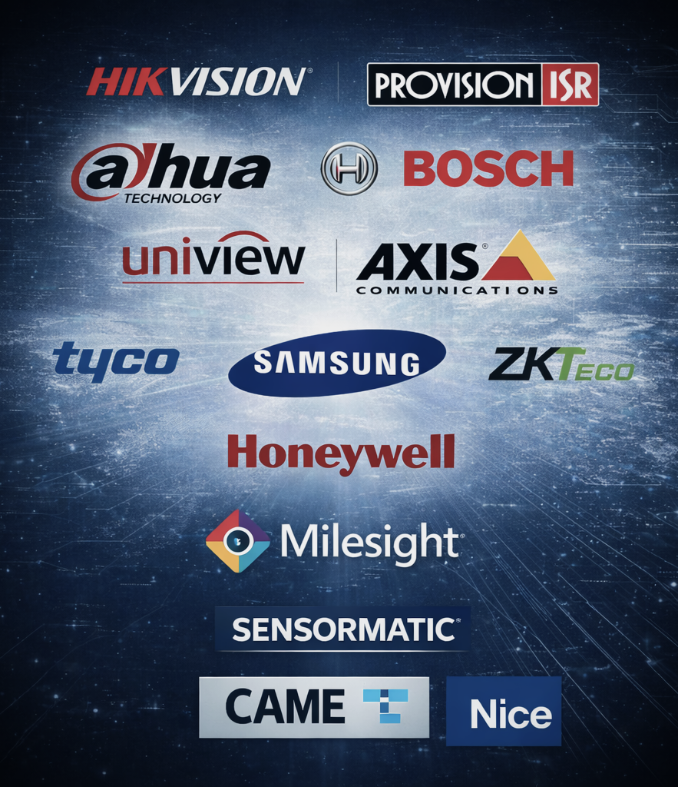
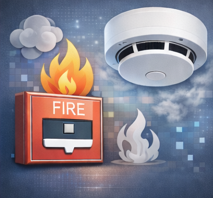
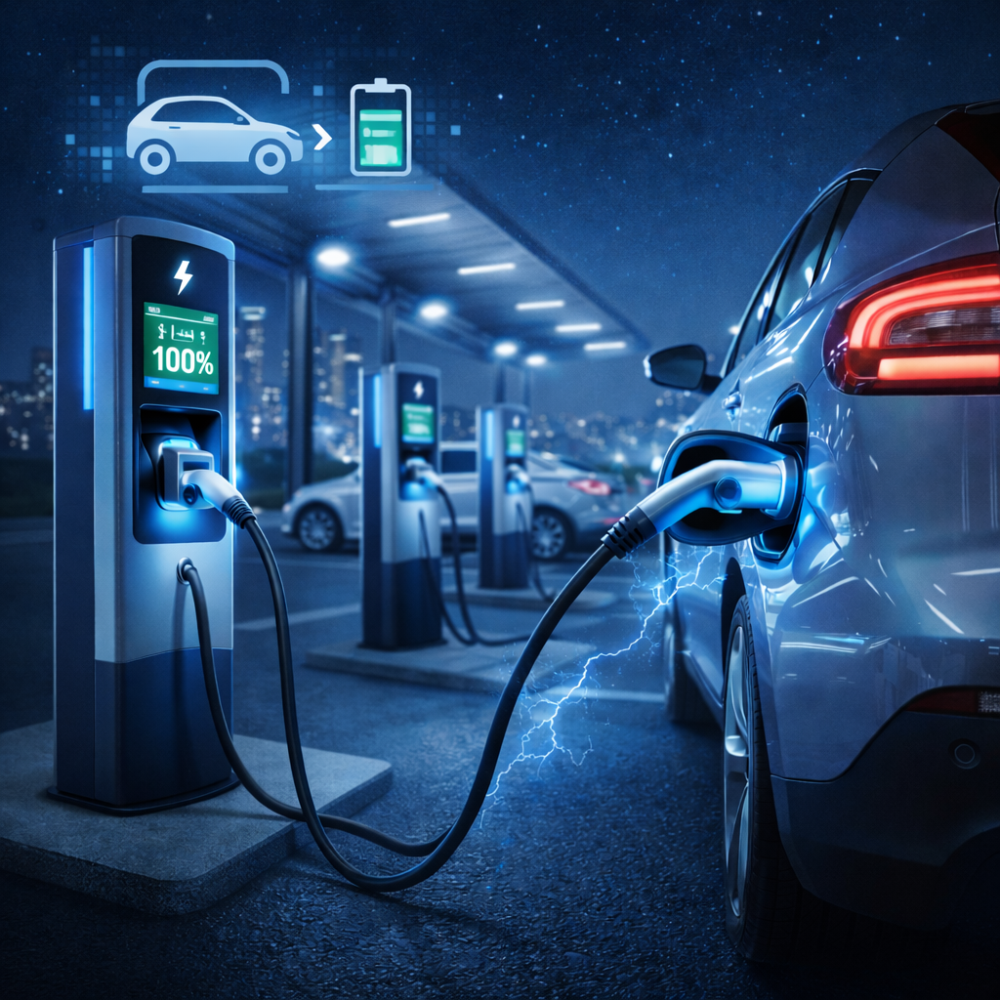

<!DOCTYPE html>
<html lang="tr">
<head>
  <meta charset="UTF-8" />
  <meta name="viewport" content="width=device-width, initial-scale=1.0" />
  <title>CLK Güvenlik Sistemleri | Premium Kurumsal Güvenlik Çözümleri</title>
  <meta name="description" content="CLK Güvenlik Sistemleri; kamera, alarm, yangın algılama, bariyer, geçiş kontrol ve akıllı ev sistemlerinde kurumsal çözümler sunar.">
  <meta name="theme-color" content="#0f172a" />

  <link rel="preconnect" href="https://fonts.googleapis.com">
  <link rel="preconnect" href="https://fonts.gstatic.com" crossorigin>
  <link href="https://fonts.googleapis.com/css2?family=Inter:wght@400;500;600;700;800;900&display=swap" rel="stylesheet">

  
</head>
<body>

  <header>
    

      <a href="#anasayfa" class="brand">
        
CLK

        

          <strong>CLK Güvenlik Sistemleri</strong>
          Premium Kurumsal Güvenlik Çözümleri
        

      </a>

      <button class="menu-toggle" id="menuToggle" aria-label="Menüyü aç/kapat">☰</button>

      <nav class="menu" id="menu">
        <a href="#anasayfa">Anasayfa</a>
        <a href="#hizmetler">Hizmetler</a>
        <a href="#projeler">Projeler</a>
        <a href="#nedenbiz">Neden Biz?</a>
        <a href="#sss">SSS</a>
        <a href="#iletisim">İletişim</a>
        <a href="https://wa.me/905368323458?text=Merhaba%20CLK%20G%C3%BCvenlik%2C%20teklif%20almak%20istiyorum." target="_blank" rel="noopener" class="btn cta">Teklif Al</a>
      </nav>
    

  </header>

  <main id="anasayfa" class="hero">
    

    

    

    

      

        • Güven veren modern kurumsal yapı
        <h1>Güvenlik sisteminizi daha premium ve daha güçlü gösterelim.</h1>
        

          Kamera, alarm, yangın algılama, bariyer, akıllı ev ve erişim kontrol projelerinde;
          keşiften kurulum ve teknik desteğe kadar markanıza yakışan, estetik ve profesyonel çözümler sunuyoruz.
        

        

          <a class="btn btn-primary" href="https://wa.me/905368323458?text=Merhaba%20CLK%20G%C3%BCvenlik%2C%20teklif%20almak%20istiyorum." target="_blank" rel="noopener">WhatsApp’tan Teklif Al</a>
          <a class="btn btn-secondary" href="#projeler">Projeleri Gör</a>
        

        

          Ücretsiz Keşif
          Garantili Kurulum
          7/24 Teknik Destek
          Kurumsal Çözüm
        

      

      

        

          
        

        
7/24 Teknik Destek

        
Kurumsal Projelendirme

        
Temiz & Garantili İşçilik

        

          

            <strong class="counter" data-target="12">0</strong>
            Yıllık Tecrübe
          

          

            <strong class="counter" data-target="950">0</strong>
            Kurulum
          

          

            <strong>7/24</strong>
            Destek
          

        

      

    

    

      

        <h3 class="counter" data-target="500">0</h3>
        
Memnun Müşteri

      

      

        <h3 class="counter" data-target="300">0</h3>
        
Aktif Sistem

      

      

        <h3 class="counter" data-target="99">0</h3>
        
Memnuniyet Oranı

      

      

        <h3>24/7</h3>
        
İletişim & Servis

      

    

  </main>

  <section class="brand-strip">
    

      Hikvision
      Dahua
      Ajax
      Paradox
      Bosch
      Ezviz
      IP Kamera
      Yangın Sistemleri
      Akıllı Ev
      Geçiş Kontrol
      Hikvision
      Dahua
      Ajax
      Paradox
      Bosch
      Ezviz
      IP Kamera
      Yangın Sistemleri
      Akıllı Ev
      Geçiş Kontrol
    

  </section>

  <section id="hizmetler" class="section">
    

      • Hizmetlerimiz
      <h2 class="title reveal">Her alan için ayrı düşünülmüş profesyonel güvenlik çözümleri</h2>
      

        Konut, site, işyeri, ofis, depo ve ticari alanlara uygun sistemleri ihtiyaca göre planlıyor; yalnızca ürün değil, doğru kurgu ve uzun ömürlü performans sunuyoruz.
      

      

        <article class="service card reveal">
          
📷

          <h3>Kamera Sistemleri</h3>
          
İç ve dış alanlarda yüksek çözünürlüklü izleme, kayıt ve uzaktan kontrol sağlayan profesyonel kamera altyapıları kuruyoruz.

          <ul>
            <li>IP ve AHD sistem seçenekleri</li>
            <li>Gece görüşü ve mobil izleme</li>
            <li>DVR / NVR kayıt çözümleri</li>
          </ul>
        </article>

        <article class="service card reveal">
          
🔥

          <h3>Yangın Algılama</h3>
          
Yangın riskini erkenden fark eden, uyarı ve yönlendirme sağlayan güvenli sistem kurguları hazırlıyoruz.

          <ul>
            <li>Dedektör ve siren çözümleri</li>
            <li>Kontrol paneli entegrasyonu</li>
            <li>Kurumsal alanlara uygun yapı</li>
          </ul>
        </article>

        <article class="service card reveal">
          
🚧

          <h3>Bariyer & Geçiş</h3>
          
Otopark, site ve işletme girişleri için kontrollü, dayanıklı ve estetik geçiş sistemleri uyguluyoruz.

          <ul>
            <li>Otomatik bariyer sistemleri</li>
            <li>Kartlı / plaka tanıma altyapısı</li>
            <li>Yoğun kullanıma uygun kurulum</li>
          </ul>
        </article>

        <article class="service card reveal">
          
🔐

          <h3>Alarm Sistemleri</h3>
          
Hırsızlık, ihlal ve çevre güvenliği risklerine karşı anlık uyarı veren alarm çözümleri sunuyoruz.

          <ul>
            <li>Kablolu ve kablosuz alternatifler</li>
            <li>Anlık bildirim ve uyarı</li>
            <li>Konut ve işyeri uyumlu sistemler</li>
          </ul>
        </article>

        <article class="service card reveal">
          
🏠

          <h3>Akıllı Ev</h3>
          
Aydınlatma, erişim, güvenlik ve kontrol sistemlerini tek merkezden yöneteceğiniz akıllı yaşam çözümleri kuruyoruz.

          <ul>
            <li>Mobil uygulama ile kontrol</li>
            <li>Senaryo ve otomasyon desteği</li>
            <li>Modern yaşam alanı entegrasyonu</li>
          </ul>
        </article>

        <article class="service card reveal">
          
🛠️

          <h3>Teknik Servis</h3>
          
Sistemler kurulduktan sonra da performansın korunması için teknik servis ve bakım desteği sağlıyoruz.

          <ul>
            <li>Periyodik bakım ve kontrol</li>
            <li>Arıza tespit ve hızlı müdahale</li>
            <li>Yerinde ve uzaktan destek</li>
          </ul>
        </article>
      

    

  </section>

  <section id="nedenbiz" class="section">
    

      

        • Neden CLK?
        <h2 class="title">Sizi yalnızca güvenli değil, daha profesyonel gösteren sistemler kuruyoruz</h2>
        

          İyi bir güvenlik sistemi yalnızca çalışmaz; iyi görünür, kullanıcıyı yormaz ve işletmenize prestij katar. Bu yüzden her projeye marka değeri gözüyle bakıyoruz.
        

      

      

        

          

            <strong>Kurumsal Görünüm</strong>
            
Kablolamadan ekipman yerleşimine kadar her detayın düzenli ve profesyonel görünmesine önem veriyoruz.

          

          

            <strong>Doğru Ürün Kurgusu</strong>
            
Gereksiz maliyet oluşturmadan ihtiyacınıza uygun sistem planlıyor, uzun vadeli verim hedefliyoruz.

          

          

            <strong>Temiz İşçilik</strong>
            
Kurulum kalitesi, sistemin ömrünü ve müşteri memnuniyetini doğrudan etkiler. Biz burada fark yaratıyoruz.

          

          

            <strong>Destek Sürekliliği</strong>
            
Kurulum sonrası iletişimi koparmıyor, gerektiğinde hızlı teknik destek ile çözüm üretiyoruz.

          

        

      

    

  </section>

  <section id="projeler" class="section">
    

      • Projelerimiz
      <h2 class="title reveal">Yaptığımız işin kalitesi, markamızın en güçlü referansıdır</h2>
      

        Kurulum sonrası temiz görünüm, kararlı çalışma ve kullanıcı deneyimi bir araya geldiğinde ortaya uzun ömürlü ve güven veren projeler çıkar.
      

      

        <article class="project card reveal">
          

          

            
KameraKurumsal Alan

            <h3>Profesyonel Kamera Altyapısı</h3>
            
Kör nokta bırakmayan planlama, net görüntü kalitesi ve uzaktan izleme desteği ile güçlü güvenlik sistemi.

          

        </article>

        <article class="project card reveal">
          

          

            
Yangınİşyeri

            <h3>Yangın Algılama Kurulumu</h3>
            
Erken uyarı sağlayan dedektör ve alarm bileşenlerinin düzenli ve kontrollü altyapı ile kurulduğu proje.

          

        </article>

        <article class="project card reveal">
          

          

            
BariyerSite Girişi

            <h3>Geçiş & Otopark Kontrolü</h3>
            
Yoğun giriş çıkışlarda güvenli, dayanıklı ve estetik görünüm sağlayan kontrollü geçiş sistemi.

          

        </article>

        <article class="project card reveal">
          

          

            
ErişimAkıllı Kilit

            <h3>Akıllı Erişim Yönetimi</h3>
            
Şifre, kart ve mobil erişim desteği ile kullanıcı kolaylığını ve güvenliği aynı yapıda buluşturan çözüm.

          

        </article>

        <article class="project card reveal">
          

          

            
EV ŞarjKonut

            <h3>Şarj Altyapı Projesi</h3>
            
Elektrikli araç kullanıcılarına uygun, güvenli ve planlı enerji erişimi sağlayan düzenli uygulama.

          

        </article>

        <article class="project card reveal">
          

          

            
AlarmEntegrasyon

            <h3>Alarm & Sensör Entegrasyonu</h3>
            
Merkezi yönetim mantığıyla çalışan, bildirim ve kontrol avantajı sunan güçlü alarm kurgusu.

          

        </article>
      

    

  </section>

  <section class="section">
    

      • Güven Unsurları
      <h2 class="title reveal">Müşterinin kararını hızlandıran detaylar burada başlar</h2>
      

        İnsanlar yalnızca fiyata bakmaz; güven, düzen, görünüm, iletişim ve teslim kalitesine bakar. Bu alan tam da o etkiyi oluşturur.
      

      

        <article class="trust-card card reveal">
          <h3>Keşif & Analiz</h3>
          
Alan yapısını görmeden ezbere çözüm önermiyoruz. İhtiyaca göre doğru sistemi planlıyoruz.

        </article>
        <article class="trust-card card reveal">
          <h3>Premium Uygulama</h3>
          
Kurulumların sadece çalışmasına değil, profesyonel görünmesine de önem veriyoruz.

        </article>
        <article class="trust-card card reveal">
          <h3>Satış Sonrası Destek</h3>
          
Kurulum bittikten sonra da ulaşılabilir teknik destek ile sistemi sürdürülebilir tutuyoruz.

        </article>
      

    

  </section>

  <section class="section">
    

      • Yorumlar
      <h2 class="title reveal">Memnuniyet, en güçlü satış aracıdır</h2>

      

        <article class="testimonial card reveal">
          
“İşletmemiz için kurulan kamera ve alarm sistemi hem düzenli hem de çok profesyonel görünüyor. İletişim ve destek de çok iyi.”

          <strong>Ahmet Y.</strong>
          İşletme Sahibi
        </article>

        <article class="testimonial card reveal">
          
“Site giriş sistemleri ve bariyer kurulumu sorunsuz tamamlandı. Baştan sona güven veren bir ekip çalışması vardı.”

          <strong>Mehmet K.</strong>
          Site Yönetimi
        </article>

        <article class="testimonial card reveal">
          
“Ofis projemizde temiz işçilik ve estetik görünüm bizim için çok önemliydi. Beklentimizin üstünde bir sonuç aldık.”

          <strong>Selin A.</strong>
          Ofis Projesi
        </article>
      

    

  </section>

  <section id="sss" class="section">
    

      

        • Sık Sorulan Sorular
        <h2 class="title">Karar vermeden önce en çok bunlar soruluyor</h2>
        

          Teklif süreci, keşif, kurulum süresi ve destek yapısı hakkında kısa ve net bilgi alın.
        

      

      

        

          <button class="faq-q">
            Ücretsiz keşif yapıyor musunuz?
            +
          </button>
          
Evet. Uygun projelerde yerinde keşif yaparak ihtiyaca göre sistem planlaması ve teklif hazırlıyoruz.

        

        

          <button class="faq-q">
            Kurulum süresi neye göre değişir?
            +
          </button>
          
Kurulum süresi alan büyüklüğü, cihaz sayısı ve proje detayına göre değişir. Keşif sonrası net bilgi verilir.

        

        

          <button class="faq-q">
            Mobil uygulama ile izleme mümkün mü?
            +
          </button>
          
Uygun sistemlerde telefon üzerinden canlı izleme, kayıt görüntüleme ve bildirim alma mümkündür.

        

        

          <button class="faq-q">
            Kurulum sonrası destek veriyor musunuz?
            +
          </button>
          
Evet. Sistem tesliminden sonra bakım, arıza müdahalesi ve kullanım desteği sağlıyoruz.

        

      

    

  </section>

  <section class="section">
    

      

        

          <h3>Alanınızı daha güvenli, markanızı daha güçlü gösterelim.</h3>
          
İhtiyacınızı dinleyelim, doğru sistemi planlayalım ve size güven veren bir çözüm hazırlayalım.

        

        <a class="btn btn-primary" href="https://wa.me/905368323458?text=Merhaba%20CLK%20G%C3%BCvenlik%2C%20kurumsal%20bir%20teklif%20almak%20istiyorum." target="_blank" rel="noopener">Teklif İste</a>
      

    

  </section>

  <section id="iletisim" class="section">
    

      

        • İletişim
        <h3>Bize hızlıca ulaşın</h3>

        

          

            <small>Telefon / WhatsApp</small>
            <a href="https://wa.me/905368323458" target="_blank" rel="noopener">0536 832 34 58</a>
          

          

            <small>E-posta</small>
            <a href="mailto:clkguvenliksistemleri@gmail.com">clkguvenliksistemleri@gmail.com</a>
          

          

            <small>Instagram</small>
            <a href="https://www.instagram.com/guvenlik_kamera_sistemleri/" target="_blank" rel="noopener">@guvenlik_kamera_sistemleri</a>
          

          

            <small>Adres</small>
            <strong>Göztepe Mah. 2395 Sk. No:7 D:6 Bağcılar / İstanbul</strong>
          

        

        

          <iframe
            src="https://maps.google.com/maps?q=Bağcılar%20İstanbul&t=&z=13&ie=UTF8&iwloc=&output=embed"
            loading="lazy"
            referrerpolicy="no-referrer-when-downgrade"
            title="CLK Güvenlik konum haritası"></iframe>
        

      

      

        • Teklif Formu
        <h3>Projenizi anlatın, mesajı hazır oluşturalım</h3>

        <form id="offerForm">
          

            <input class="field" id="name" type="text" placeholder="Ad Soyad" required>
            <input class="field" id="phone" type="tel" placeholder="Telefon" required>
          

          

            <input class="field" id="service" type="text" placeholder="İlgilendiğiniz hizmet">
            <input class="field" id="location" type="text" placeholder="İlçe / Lokasyon">
          

          

            <textarea class="field" id="message" placeholder="Kısaca proje detayınızı yazın"></textarea>
          

          

            <button class="btn btn-primary" type="submit">WhatsApp’tan Gönder</button>
          

        </form>

        

          Form gönderildiğinde bilgileriniz WhatsApp mesajı olarak hazırlanır ve doğrudan bize iletebilirsiniz.
        

      

    

  </section>

  <footer>
    

      
©  CLK Güvenlik Sistemleri • Tüm hakları saklıdır.

      

        <a href="#anasayfa">Anasayfa</a> •
        <a href="#hizmetler">Hizmetler</a> •
        <a href="#projeler">Projeler</a> •
        <a href="#iletisim">İletişim</a>
      

    

  </footer>

  <a class="fab" href="https://wa.me/905368323458?text=Merhaba%20CLK%20G%C3%BCvenlik%2C%20bilgi%20almak%20istiyorum." target="_blank" rel="noopener" aria-label="WhatsApp">☎</a>

  

    

      <button class="lightbox-close" id="lightboxClose" aria-label="Kapat">✕</button>
      
    

  

  
</body>
</html>
