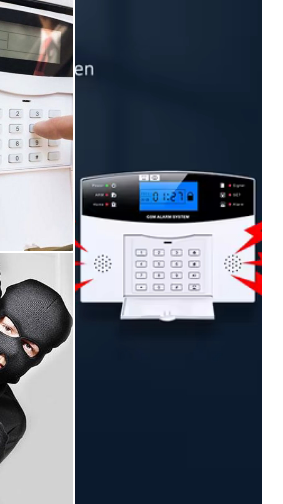

<html lang="tr">
<head>
  <meta charset="utf-8" />
  <meta name="viewport" content="width=device-width, initial-scale=1" />
  <title>CLK Güvenlik Sistemleri</title>
  <meta name="description" content="Kamera, alarm, yangın, akıllı ev ve otomatik bariyer sistemleri – CLK Güvenlik Sistemleri" />
  <link rel="preconnect" href="https://fonts.googleapis.com">
  <link rel="preconnect" href="https://fonts.gstatic.com" crossorigin>
  <link href="https://fonts.googleapis.com/css2?family=Inter:wght@400;500;600;700;800&family=Montserrat:wght@700;800&display=swap" rel="stylesheet">
  
</head>
<body>
  <header>
    

      

        
CLK

        <h1>Güvenlik Sistemleri</h1>
      

      <nav class="menu">
        <a href="#anasayfa">Anasayfa</a>
        <a href="#hizmetler">Hizmetler</a>
        <a href="#galeri">Galeri</a>
        <a href="#iletisim">İletişim</a>
      </nav>
    

  </header>

  <main id="anasayfa" class="hero">
    

      

        <h2>Profesyonel Güvenlik Çözümleri</h2>
        
 Kamera, alarm, yangın algılama, akıllı ev ve bariyer sistemlerinde keşiften kuruluma kadar uçtan uca hizmet. <strong>CLK Güvenlik Sistemleri</strong> ile mekânlarınız güvende. 

        

          <a class="btn btn-primary" href="https://wa.me/905368323458?text=Merhaba%20CLK%20G%C3%BCvenlik%2C%20teklif%20almak%20istiyorum." target="_blank" rel="noopener">WhatsApp'tan Yaz</a>
          <a class="btn btn-soft" href="https://www.instagram.com/guvenlik_kamera_sistemleri/" target="_blank" rel="noopener">Instagram'ı Gör</a>
        

        
7/24 Destek • Ücretsiz Keşif • Garantili Kurulum

      

      

        
      

    

  </main>

  <section id="hizmetler" class="section">
    

      <h3>Hizmetlerimiz</h3>
      
İhtiyacınıza özel projelendirme, kaliteli ekipman ve uzman montaj ile güvenliğinizi bir üst seviyeye taşıyoruz.

      

        <article class="card">
          Kamera
          <h4>IP & AHD Kamera Sistemleri</h4>
          
Yüksek çözünürlük, gece görüşü, uzaktan izleme ve kayıt çözümleri.

        </article>
        <article class="card">
          Yangın
          <h4>Yangın Algılama & İhbar</h4>
          
Dedektör, siren ve kontrol panelleriyle EN standartlarında güvenlik.

        </article>
        <article class="card">
          Otomatik Bariyerler
          <h4>Geçiş & Otopark Sistemleri</h4>
          
Site, otopark ve tesis girişleri için bariyer, road blocker ve mantar sistemler.

        </article>
        <article class="card">
          Elektrikli Şarj İstasyonu
          <h4>EV Şarj Çözümleri</h4>
          
AC/DC şarj cihazları, kurulum ve işletme danışmanlığı.

        </article>
        <article class="card">
          Akıllı Kilit Kapı
          <h4>Erişim Kontrol</h4>
          
Kart/şifre/biyometrik kilit sistemleri ve kapı otomasyonu.

        </article>
        <article class="card">
          Alarm
          <h4>Hırsız & Çevre Güvenliği</h4>
          
Kablosuz/kablolu alarm, dedektörler ve 7/24 haber alma entegrasyonu.

        </article>
        <article class="card">
          Akıllı Ev
          <h4>Otomasyon & Entegrasyon</h4>
          
Aydınlatma, iklimlendirme ve güvenliği tek uygulamadan yönetin.

        </article>
        <article class="card">
          Sistemleri
          <h4>Projelendirme & Bakım</h4>
          
Keşif, çizim, kurulum sonrası bakım sözleşmeleri ve eğitim.

        </article>
        <article class="card">
          Destek
          <h4>7/24 Teknik Destek</h4>
          
Uzak bağlantı ve yerinde servis ile hızlı çözüm.

        </article>
      

    

  </section>

  <section id="galeri" class="section" style="padding-top:40px">
    

      <h3>Yaptığımız İşlerden</h3>
   

  

        <figure>
          
          <figcaption>Kamera kurulumu</figcaption>
        </figure>
        <figure>
          
          <figcaption>Yangın algılama</figcaption>
        </figure>
        <figure>
          
          <figcaption>Otopark bariyer</figcaption>
        </figure>
        <figure>
          
          <figcaption>Akıllı kilit</figcaption>
        </figure>
        <figure>
          
          <figcaption>Ev-Otopark şarj istasyonu</figcaption>
        </figure>
        <figure>
          
          <figcaption>Alarm ve sensör entegrasyonu</figcaption>
        </figure>
      

    

  </section>

  <section id="iletisim" class="section contact">
    

      

        <h3>İletişim</h3>
        

        <ul style="list-style:none;padding:0;margin:0">
          <li><strong>Telefon / WhatsApp:</strong> <a href="https://wa.me/905368323458" target="_blank" rel="noopener">0536 832 34 58</a></li>
          <li><strong>Instagram:</strong> <a href="https://www.instagram.com/guvenlik_kamera_sistemleri/" target="_blank" rel="noopener">@guvenlik_kamera_sistemleri</a></li>
          <li><strong>E-posta:</strong> <a href="mailto:clkguvenliksistemleri@gmail.com">clkguvenliksistemleri@gmail.com</a></li>
        </ul>
      

      

        <h3>Neden Biz?</h3>
        

        
Kurumsal yaklaşım, kaliteli ekipman ve uzman montaj ile uzun ömürlü çözümler sunuyoruz. Ücretsiz keşif ve projelendirme ile bütçenize uygun teklif hazırlıyoruz.

        <ul>
          <li>Ücretsiz keşif ve danışmanlık</li>
          <li>Marka garantili ürünler</li>
          <li>Hızlı kurulum & 7/24 destek</li>
        </ul>
      

    

  </section>

  <footer>
    

      ©  CLK Güvenlik Sistemleri • Tüm hakları saklıdır.
    

  </footer>
  
  <!-- Sabit WhatsApp & Instagram butonları -->
  

    <a class="fab" href="https://wa.me/905368323458?text=Merhaba%20CLK%20G%C3%BCvenlik%2C%20bilgi%20almak%20istiyorum." target="_blank" rel="noopener" title="WhatsApp">
      <!-- WhatsApp SVG -->
      <svg width="26" height="26" viewBox="0 0 24 24" fill="none" xmlns="http://www.w3.org/2000/svg" aria-hidden="true"><path d="M20.52 3.48A11.94 11.94 0 0 0 12.01 0C5.38 0 0 5.38 0 12.01c0 2.12.56 4.17 1.63 5.99L0 24l6.19-1.62a11.97 11.97 0 0 0 5.82 1.48h.01c6.63 0 12.01-5.38 12.01-12.01 0-3.21-1.25-6.22-3.51-8.36ZM12.02 21.3h-.01a9.3 9.3 0 0 1-4.75-1.3l-.34-.2-3.68.96.98-3.59-.22-.37a9.27 9.27 0 1 1 8.02 4.5Zm5.38-6.94c-.29-.15-1.72-.85-1.98-.94-.26-.1-.45-.15-.64.15-.19.29-.74.94-.9 1.13-.17.19-.33.22-.62.07-.29-.15-1.22-.45-2.33-1.43-.86-.76-1.44-1.69-1.61-1.98-.17-.29-.02-.45.13-.59.13-.13.29-.33.43-.49.15-.17.19-.29.29-.48.1-.19.05-.36-.02-.51-.07-.15-.64-1.54-.88-2.1-.23-.56-.47-.48-.64-.49l-.54-.01c-.19 0-.5.07-.76.36-.26.29-1 1-1 2.43 0 1.43 1.02 2.8 1.16 2.99.15.19 2 3.05 4.86 4.28.68.29 1.21.45 1.62.58.68.22 1.3.19 1.79.12.55-.08 1.72-.7 1.97-1.38.24-.68.24-1.27.17-1.39-.07-.12-.26-.19-.55-.34Z" fill="#25D366"/></svg>
    </a>
    <a class="fab" href="https://www.instagram.com/guvenlik_kamera_sistemleri/" target="_blank" rel="noopener" title="Instagram">
      <!-- Instagram SVG -->
      <svg width="24" height="24" viewBox="0 0 24 24" fill="none" xmlns="http://www.w3.org/2000/svg" aria-hidden="true"><path d="M12 2.16c3.2 0 3.584.012 4.85.07 1.17.054 1.97.24 2.43.4.61.21 1.05.46 1.51.92.46.46.71.9.92 1.51.16.46.35 1.26.4 2.43.06 1.27.07 1.65.07 4.85s-.01 3.58-.07 4.85c-.05 1.17-.24 1.97-.4 2.43-.21.61-.46 1.05-.92 1.51-.46.46-.9.71-1.51.92-.46.16-1.26.35-2.43.4-1.27.06-1.65.07-4.85.07s-3.58-.01-4.85-.07c-1.17-.05-1.97-.24-2.43-.4a3.9 3.9 0 0 1-1.51-.92 3.9 3.9 0 0 1-.92-1.51c-.16-.46-.35-1.26-.4-2.43C2.17 15.59 2.16 15.2 2.16 12s.01-3.58.07-4.85c.05-1.17.24-1.97.4-2.43.21-.61.46-1.05.92-1.51.46-.46.9-.71 1.51-.92.46-.16 1.26-.35 2.43-.4C8.42 2.17 8.8 2.16 12 2.16Zm0 1.73c-3.15 0-3.52.01-4.76.07-.99.05-1.53.21-1.89.35-.48.19-.83.42-1.19.78-.36.36-.59.71-.78 1.19-.14.36-.3.9-.35 1.89-.06 1.24-.07 1.61-.07 4.76s.01 3.52.07 4.76c.05.99.21 1.53.35 1.89.19.48.42.83.78 1.19.36.36.71.59 1.19.78.36.14.9.3 1.89.35 1.24.06 1.61.07 4.76.07s3.52-.01 4.76-.07c.99-.05 1.53-.21 1.89-.35.48-.19.83-.42 1.19-.78.36-.36.59-.71.78-1.19.14-.36.3-.9.35-1.89.06-1.24.07-1.61.07-4.76s-.01-3.52-.07-4.76c-.05-.99-.21-1.53-.35-1.89a3.04 3.04 0 0 0-.78-1.19 3.04 3.04 0 0 0-1.19-.78c-.36-.14-.9-.3-1.89-.35-1.24-.06-1.61-.07-4.76-.07Zm0 3.07a6.97 6.97 0 1 1 0 13.94 6.97 6.97 0 0 1 0-13.94Zm0 1.73a5.24 5.24 0 1 0 0 10.48 5.24 5.24 0 0 0 0-10.48Zm5.45-2.07a1.63 1.63 0 1 1 0 3.27 1.63 1.63 0 0 1 0-3.27Z" fill="#E1306C"/></svg>
    </a>
  

  
</body>
</html>
